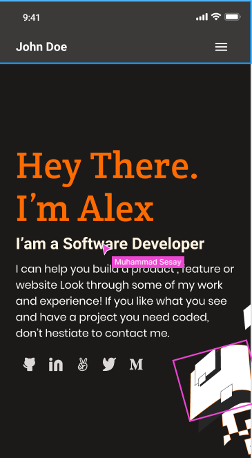

# Alex's Portfolio

## Live Demo (no images can be hosted)
https://wikitelmex.github.io/Portfolio/

> This is Alex portfolio, with an microverse template selected from figma.

This will be the main portfolio for me, starting in the day 3 of the first week on the Microverse program.

## Built With

- HTML
- CSS

## Getting Started

To get a local copy up and running follow these simple example steps.

## Authors

👤 **Alex Castillo**

- GitHub: [@githubhandle](https://github.com/wikitelmex)

## Show your support

Give a ⭐️ if you like this project!

## 📝 License

This project is [MIT](./LICENSE) licensed.
